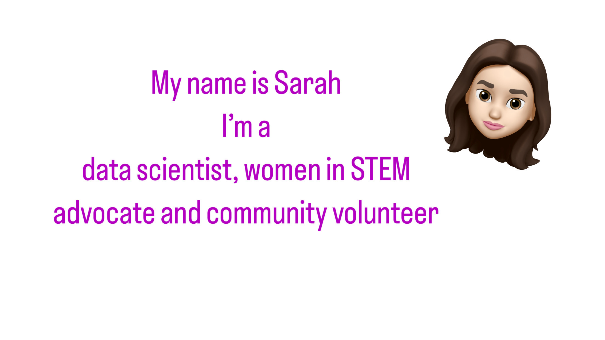

### Hi there 👋🏻👩🏻‍💻

## What I'm Currently Doing

- 👩🏻‍💻 Working on a Data Science Bootcamp to expand my skills.
- 📊 Passionate about data engineering and analytics.
- 🌐 Seeking collaboration and guidance in the field.

## Who I Am

- 🧬 Data engineer and scientist with an electrical engineering background.
- 🎶 Also a music producer and Capoeirista.
- ✈️ Have traveled to more than 50 countries, speak 4 languages, and visit Europe every year, staying for months.

## Get in Touch

- 🌐 Explore my [Portfolio](https://sara-zeus.github.io).
- 💼 Connect on [LinkedIn](https://www.linkedin.com/in/sarasalehi7/).
- 🚀 Let's chat about all things data! Feel free to explore my repositories.

    

Thanks for visiting my GitHub profile! Feel free to explore my repositories and get in touch if you'd like to collaborate or chat about all things data. ☺️

  

  

  
